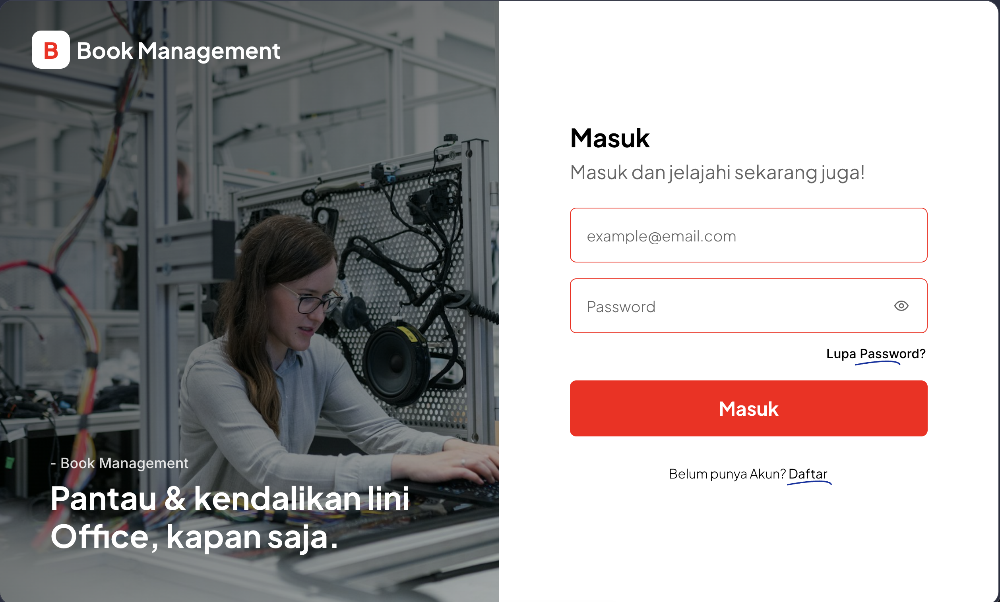

# Book Management - FDTEST

<p align="center">
  
</p>

## Tech Stack
- **Framework**: Laravel 11 (Inertia.js)
- **Frontend**: Vue 3 + Vite
- **Database**: PostgreSQL
- **Containerization**: Docker & Docker Compose
- **UI**: Custom CSS + Chart.js

## Requirements
1. **Docker & Docker Compose** (untuk menjalankan PostgreSQL, PHP, dan Nginx)
2. **Composer** (untuk dependency PHP)
3. **Node.js 18+** & **npm** (untuk dependency frontend)

---

## Cara Install & Jalankan (Dengan Docker)

### 1. Clone & Install Dependencies
```bash
git clone https://github.com/rzkjanuarr/bm_fdtest
cd bm_fdtest
composer install
npm install
```

### 2. Setup Environment
```bash
cp .env.example .env
php artisan key:generate
```

Pastikan konfigurasi di `.env` sudah benar untuk PostgreSQL:
```env
DB_CONNECTION=pgsql
DB_HOST=db
DB_PORT=5432
DB_DATABASE=bm_fdtest
DB_USERNAME=laravel
DB_PASSWORD=laravel
```

### 3. Jalankan Docker Compose
Jalankan PostgreSQL, PHP, dan Nginx dengan Docker:
```bash
docker-compose up -d
```

### 4. Jalankan Migrasi Database
Setelah container berjalan, jalankan migrasi:
```bash
docker-compose exec app php artisan migrate:fresh --seed
```

### 5. Build Assets & Jalankan Vite Dev Server
```bash
npm run dev
```

### 6. Akses Aplikasi
- **Aplikasi**: `http://localhost:8000`
---

## Cara Install & Jalankan (Tanpa Docker)

### 1. Clone & Install Dependencies
```bash
git clone https://github.com/rzkjanuarr/bm_fdtest
cd bm_fdtest
composer install
npm install
```

### 2. Setup Environment
```bash
cp .env.example .env
php artisan key:generate
```
Update konfigurasi database di `.env` sesuai dengan setup lokal kamu.

### 3. Jalankan Migrasi
```bash
php artisan migrate
```

### 4. Build Assets
```bash
npm run dev
```

### 5. Jalankan Server
```bash
php artisan serve
```
Akses di browser: `http://127.0.0.1:8000`

---

## Fitur Utama
- ✅ **Autentikasi** (Login, Register, Logout, Forgot Password)
- ✅ **Dashboard** dengan statistik dan chart user & buku
- ✅ **Manajemen User** (CRUD, Filter, Search, Role: Super Admin/User)
- ✅ **Manajemen Buku** (CRUD, Filter, Search, Rating 1-5)
- ✅ **Toast Notifications**
- ✅ **Responsive Design**
- ✅ **Data Pagination**
- ✅ **Soft Delete**

---

## Rute Halaman
| Route | Deskripsi | Auth |
|-------|-----------|------|
| `/` | Landing | Guest |
| `/login` | Login | Guest |
| `/register` | Register | Guest |
| `/forgot-password` | Lupa Password | Guest |
| `/dashboard` | Dashboard utama | Auth + Verified |
| `/user` | Kelola pengguna | Auth + Verified |
| `/book` | Kelola buku | Auth + Verified |

---
